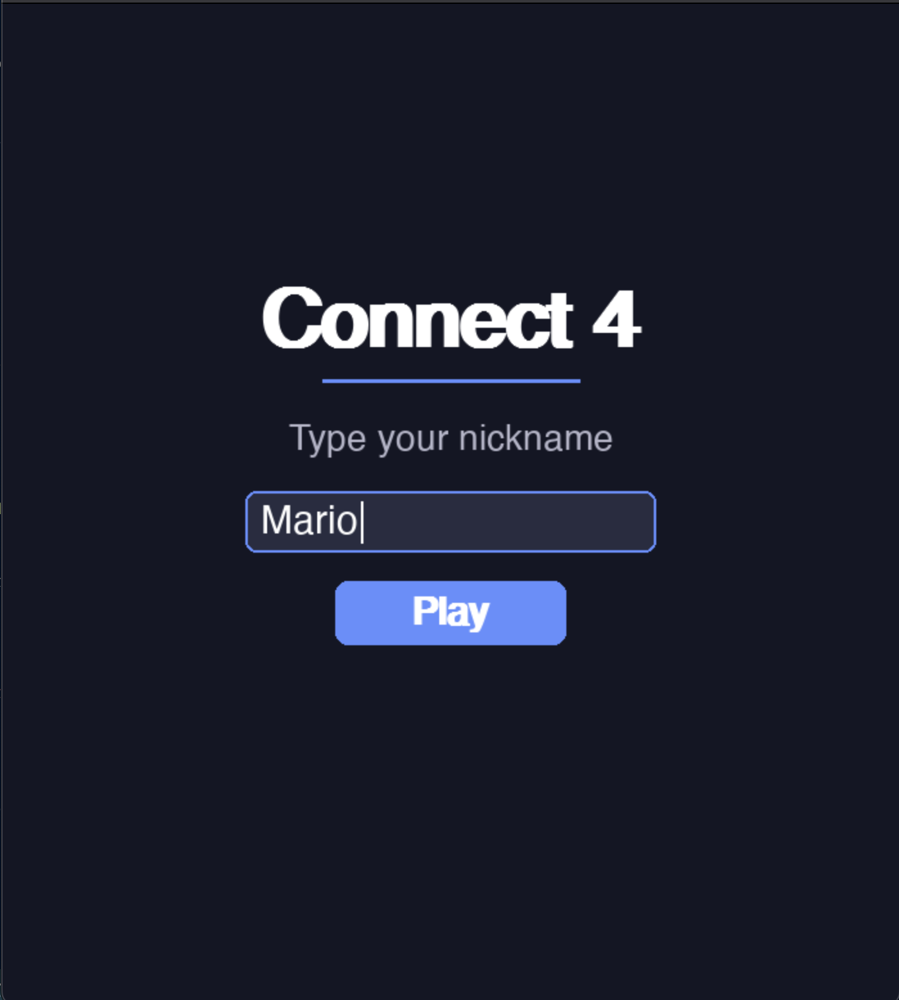
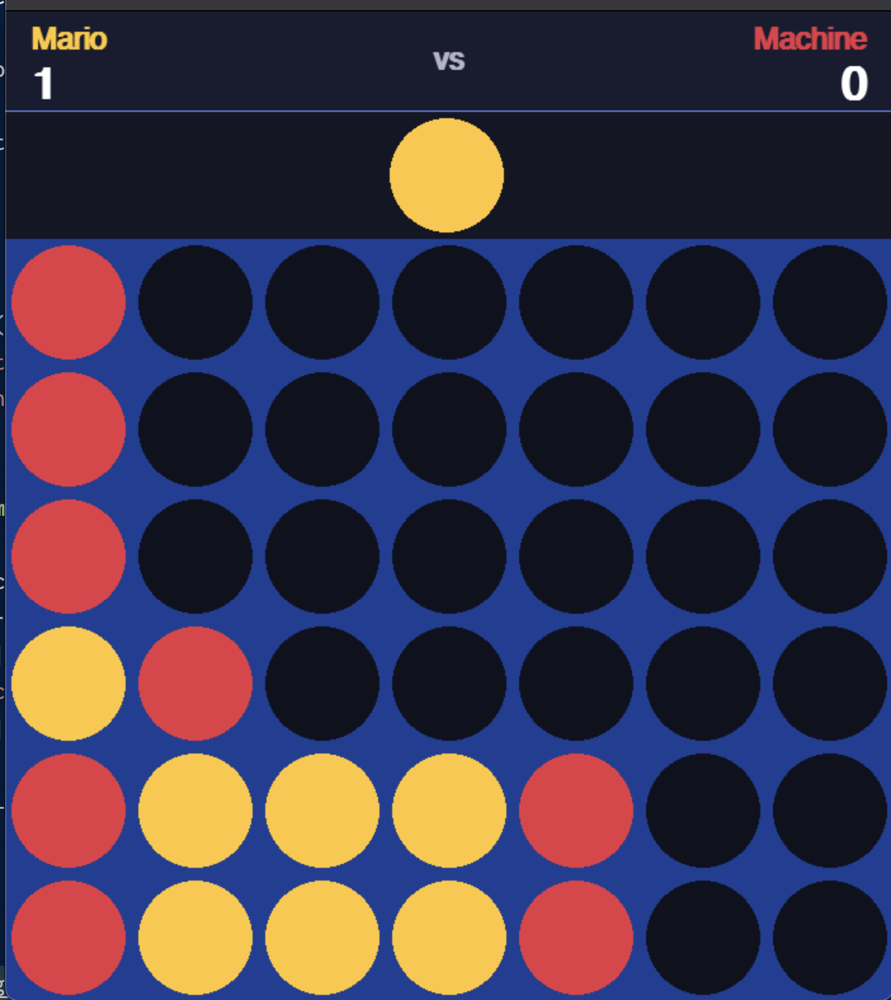
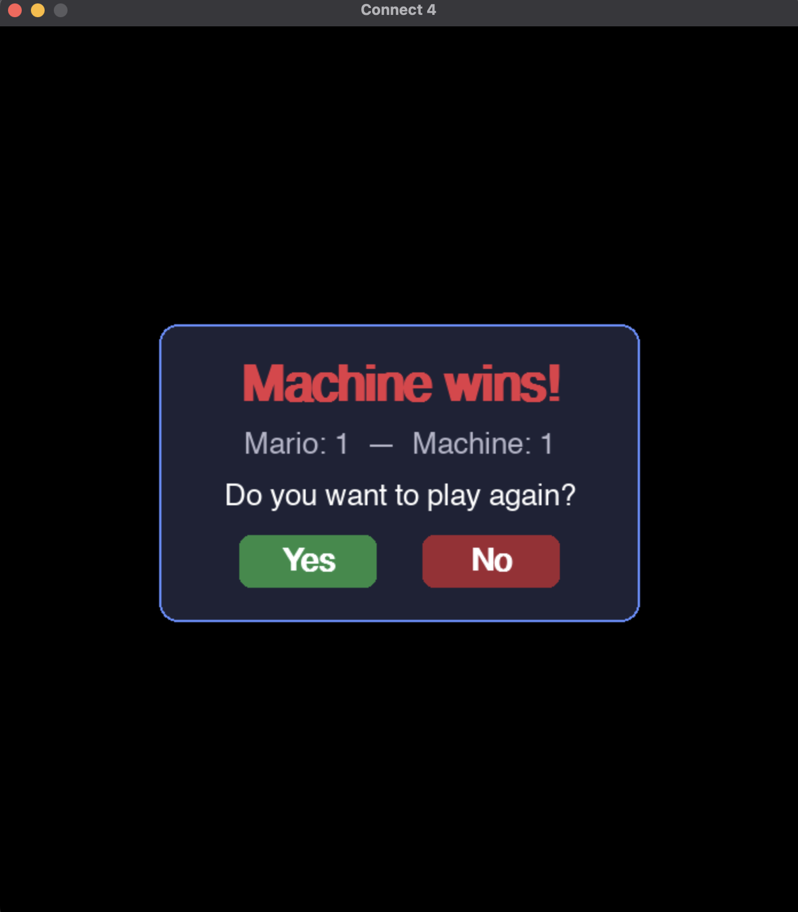

# Connect 4 Game - Reinforcement Learning Course

This is a Connect 4 game with a reinforcement learning agent.
It is a project for the Reinforcement Learning course at the Universidad de los Andes in 2024.
We were asked to implement a reinforcement learning agent to play Connect 4 using Q-learning.

I will incrementally add features to this project for example include levels of difficulty for the agent.
I plan to use a neural network to approximate the Q-values in the next release.

## Setup

1. Install [uv](https://docs.astral.sh/uv/getting-started/installation/)
2. Run `make setup` to create a virtual environment and install dependencies.
3. Run `make run` to start the game.
4. Enjoy!

## Available Commands

| Command | Description |
| --------- | ------------- |
| `make setup` | Create virtual environment and install dependencies |
| `make typecheck` | Run type checking |
| `make train` | Train the RL agent using Q-learning |
| `make test` | Run tests |
| `make run` | Launch the Connect 4 game |

## Screenshots

<!-- markdownlint-disable MD033 -->

<!-- markdownlint-enable MD033 -->

## Author

    - Mario Reyes Ojeda
