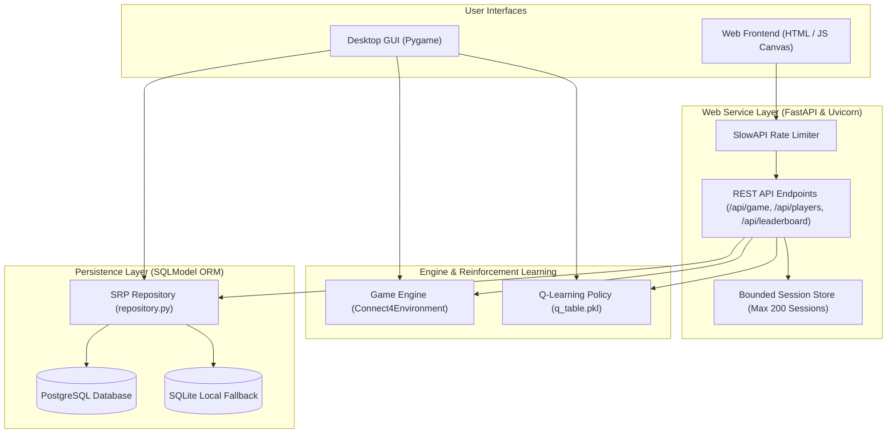

# Connect 4 Game - Reinforcement Learning Course

This is a Connect 4 game with a reinforcement learning agent.
It is a project for the Reinforcement Learning course at the Universidad de los Andes in 2024.
We were asked to implement a reinforcement learning agent to play Connect 4 using Q-learning.

I will incrementally add features to this project for example include levels of difficulty for the agent.
I plan to use a neural network to approximate the Q-values in the next release.

## First and Foremost, Play :D

Go to https://rl-connect4-game.onrender.com/
You could see a cold starter, it's because is running on a free tier.
Enjoy!

## Setup

1. Install [uv](https://docs.astral.sh/uv/getting-started/installation/)
2. Run `make setup` to create a virtual environment and install dependencies.
3. Run `make run` to start the game.
4. Enjoy!

## Available Commands

| Command | Description |
| --------- | ------------- |
| `make setup` | Create virtual environment and install dependencies |
| `make typecheck` | Run type checking |
| `make train` | Train the RL agent using Q-learning |
| `make test` | Run tests |
| `make run` | Launch the Connect 4 game |
| `make web` | Launch the FastAPI web server |

## Solution Architecture



## FastAPI Limits and Safeguards

To ensure system stability and memory safety when deployed on resource-constrained environments (e.g. 512 MB RAM free tier), FastAPI enforces the following operational limits:

### 1. Endpoint Rate Limiting (SlowAPI)
- `POST /api/game/new`: 10 requests / minute per IP.
- `POST /api/game/{session_id}/move`: 30 requests / minute per IP.
- `GET /api/game/{session_id}`: 30 requests / minute per IP.
- Exceeding these limits returns `HTTP 429 Too Many Requests`.

### 2. In-Memory Session Bounding
- Active game sessions are stored in a bounded `OrderedDict` capped at `MAX_SESSIONS = 200`.
- Uses FIFO (First-In, First-Out) eviction to pop oldest inactive sessions when capped, keeping RAM usage low.

### 3. Leaderboard Access Control
- `GET /api/leaderboard`: Restricted to players with at least 1 played match. Returns `HTTP 403 Forbidden` for new players prior to completing a game.

## Screenshots

<!-- markdownlint-disable MD033 -->


<!-- markdownlint-enable MD033 -->

## Deployment to Google Cloud Platform (GCP)

You can deploy the complete Connect 4 web app and PostgreSQL database to **GCP Compute Engine (e2-micro Always Free tier in us-central1)** at **$0 monthly cost**.

### 1. Provision GCP VM & Firewalls
Run the setup script:
```bash
./scripts/deploy_vm_all_in_one.sh <YOUR_GCP_PROJECT_ID> us-central1-a
```

### 2. Stream Database Migration from Render to GCP
Stream your data directly from Render to GCP using the single-command migration script:
```bash
./scripts/migrate_render_to_gcp.sh "<RENDER_DATABASE_URL>" "postgresql://connect4_user:connect4_pass@<VM_IP>:5432/connect4_db"
```

## Author

    - Mario Reyes Ojeda

